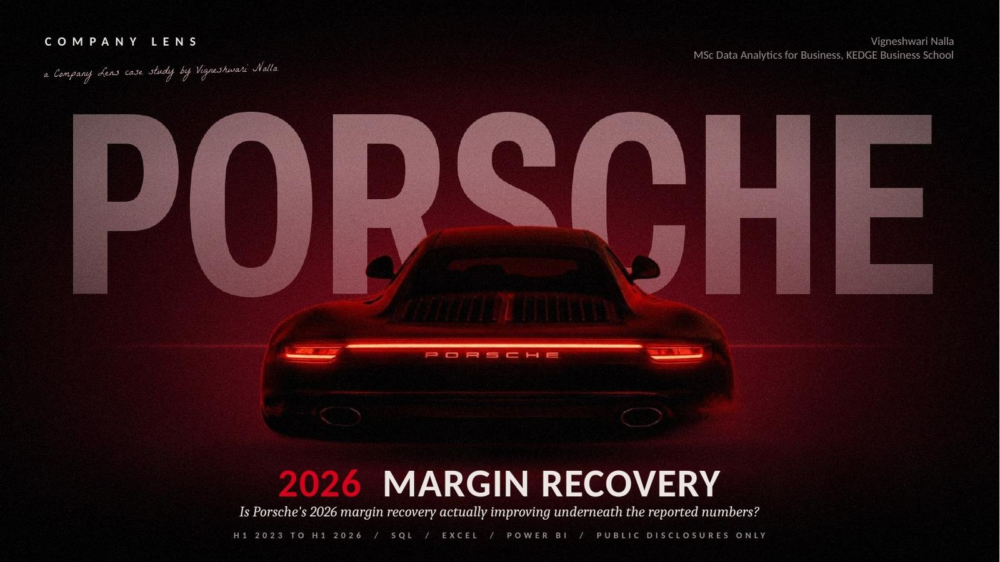
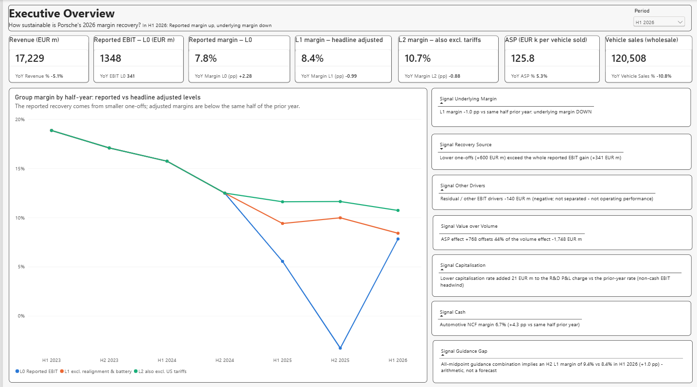
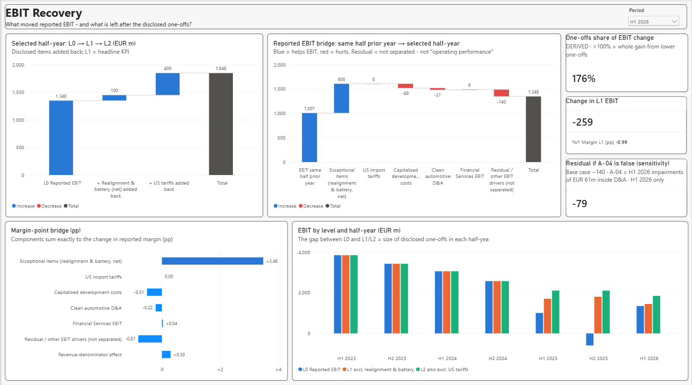
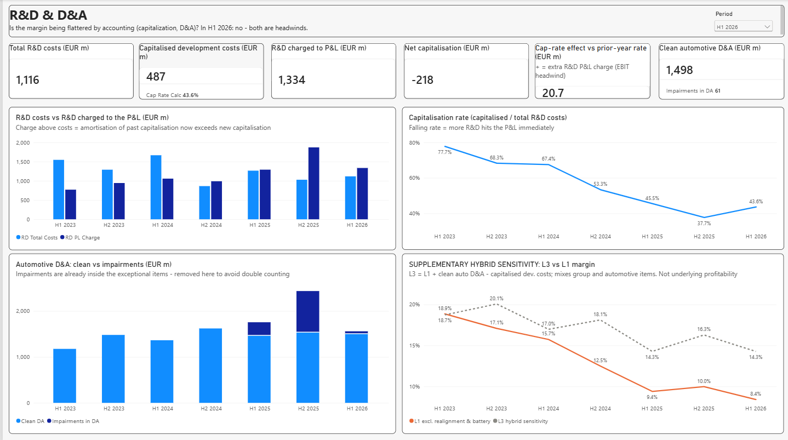
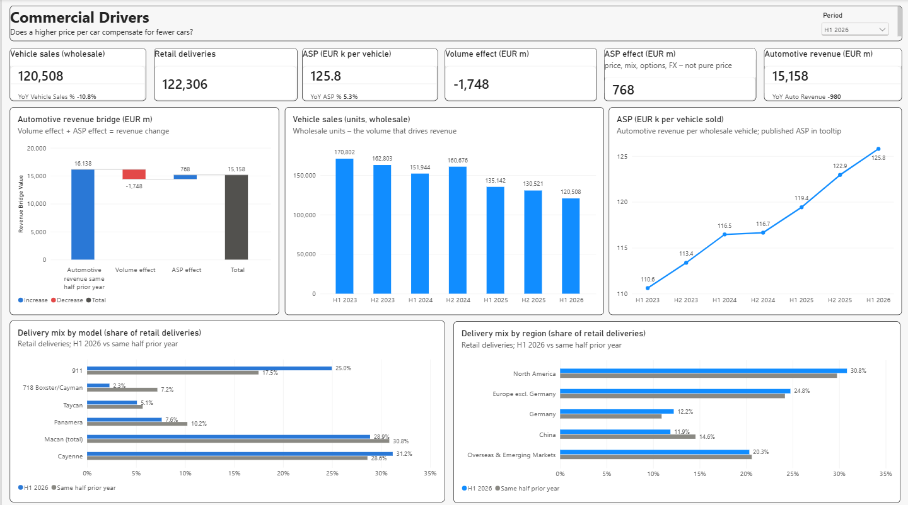
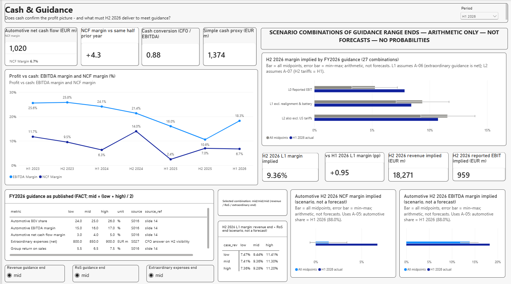
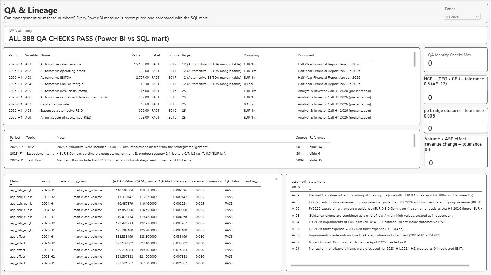
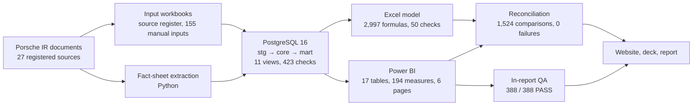

# Porsche Margin Recovery — H1 2026

**Porsche's reported margin rose from 5.5% to 7.8% in H1 2026. Is the business actually improving underneath? An end-to-end SQL → Excel → Power BI investigation built only on Porsche's public disclosures, reconciled across 1,524 automated comparisons with 0 failures.**

[Key findings](#4-key-findings) | [Dashboard](#7-power-bi-dashboard) | [Interactive website](#8-interactive-portfolio) | [Presentation (PDF)](presentation/Porsche_Margin_Recovery_Deck.pdf) | [Full report](Porsche_Margin_Recovery_Report.md) | [Case study](Case_Study.md) | [SQL](sql/) | [QA](qa/)

> Independent portfolio project by Vigneshwari Nalla. Built only on Porsche AG's public investor-relations documents. Not affiliated with, reviewed or endorsed by Porsche AG. Not investment advice.

---

## 1. Executive Summary

The H1 2026 recovery is a **reported** recovery, not yet an **underlying** one.

| | H1 2025 | H1 2026 | Change |
|---|---:|---:|---:|
| Reported margin (L0) | 5.5% | **7.8%** | +2.28 pp |
| Underlying margin (L1, excl. disclosed realignment & battery items) | 9.4% | **8.4%** | −0.99 pp |
| One-offs share of the reported EBIT gain | | **176%** | +€600m of a +€341m gain |
| Automotive net cash flow margin | 2.4% | **6.7%** | +4.3 pp |

- **Smaller one-offs explain more than the whole EBIT gain.** Without them, EBIT would have fallen.
- **A higher price per car offsets only 44% of the volume loss** (vehicle sales −10.8%, ASP +5.3%).
- **Accounting is a headwind, not a hidden tailwind:** less R&D is capitalised (43.6%, from 45.5%).
- **Cash is the clearly positive signal.**
- **On Porsche's own FY2026 guidance, H2 must improve on H1:** with every range at its midpoint, the implied H2 underlying margin is 9.36% vs 8.41% in H1. *Scenario arithmetic, not a forecast.*

## 2. Business Question

> After removing Porsche's disclosed one-offs and isolating non-cash accounting effects, is underlying profitability improving, and what does FY2026 guidance require from H2?

A recovering headline can hide three things, and each one is tested:

| Possible illusion | Tested by |
|---|---|
| Smaller one-off charges rather than a better business | Margin levels L0 → L1 → L2 and a year-on-year EBIT bridge |
| Accounting effects from R&D capitalisation or depreciation | R&D capitalisation rate, P&L charge, clean D&A |
| A richer price and mix hiding fewer cars | Volume vs ASP decomposition and delivery mix |

## 3. What I Investigated

| Area | Question | Dashboard page |
|---|---|---|
| Margin levels | How much of the margin is reported vs underlying? | 1 Executive Overview |
| EBIT bridge | What moved reported EBIT year on year? | 2 EBIT Recovery |
| R&D and D&A | Is accounting flattering the margin? | 3 R&D & D&A |
| Commercial drivers | Does a higher price per car compensate for fewer cars? | 4 Commercial Drivers |
| Cash and guidance | Does cash confirm profit, and what must H2 deliver? | 5 Cash & Guidance |
| QA and lineage | Can every number be traced and trusted? | 6 QA & Lineage |

## 4. Key Findings

Figures are H1 2026 vs H1 2025 (same half of the prior year), € million unless stated. Each is labelled by type.

**Reported actuals (published by Porsche)**

| Metric | H1 2025 | H1 2026 |
|---|---:|---:|
| Group revenue | 18,157 | 17,229 |
| Reported EBIT (L0) | 1,007 | 1,348 |
| Automotive revenue | 16,138 | 15,158 |
| Vehicle sales (wholesale units) | 135,142 | 120,508 |
| Automotive EBITDA margin | 16.0% | 18.3% |
| Automotive net cash flow | | 1,020 |

**Analytical bridges (derived from published figures)**

| Bridge | Result |
|---|---|
| L0 → L1 → L2, H1 2026 | 1,348 + 100 realignment & battery (net) = **1,448** + 400 US tariffs = **1,848** |
| Reported EBIT, year on year | 1,007 → +600 exceptional items, 0 tariffs, −88 capitalised development, −37 clean D&A, +6 Financial Services, **−140 residual** → 1,348 |
| Automotive revenue | 16,138 → **−1,748 volume effect** + **+768 ASP effect** → 15,158 (**−980**) |
| R&D | R&D costs 1,116; capitalised 487 (43.6%); P&L charge 1,334; net capitalisation −218 |

The residual (−€140m) bundles price, mix, volume, cost and FX that published data cannot separate. It is not "operating performance". It stays negative (−€79m) under the alternative impairment assumption A-04.

**Guidance (as published by Porsche, FY2026)**

Group revenue €35–36bn | return on sales 5.5–7.5% | automotive EBITDA margin 15–17% | automotive net cash flow margin 3–5% | extraordinary expenses (net) €0.8–0.9bn.

**Scenario analysis: arithmetic only, not forecasts, no probabilities**

Each guidance range is taken at its low, mid and high end and the ends are combined: 27 combinations for the group, 9 for the automotive segment. H2 = implied full year − H1 2026 actual.

| Implied H2 2026 | Range across combinations | All midpoints* | H1 2026 actual |
|---|---:|---:|---:|
| L0 margin | 3.25% – 7.20% | 5.25% | 7.82% |
| L1 margin | 7.10% – 11.69% | 9.36% | 8.41% |
| L2 margin | 9.23% – 13.94% | 11.54% | 10.73% |
| Automotive NCF margin | −0.62% – 3.41% | 1.42% | 6.73% |

\*"All midpoints" is not a most-likely case. Assumptions: A-05 (automotive share of revenue held at its H1 2026 level, 88.0%), A-06 (extraordinary-expense guidance is net, like H1), A-07 (H2 tariffs = H1, €0.4bn), A-08 (range ends combined independently).

## 5. Analytical Approach

- **Margin levels:**
  - **L0** = reported EBIT.
  - **L1** = L0 + Porsche's disclosed realignment and battery items (net). This is the headline underlying KPI.
  - **L2** = L1 + US import tariffs.
  - **L3** = a hybrid sensitivity only, never a KPI.
- **Grain:** seven half-years, H1 2023 to H1 2026. H2 = FY − H1 for flow items only, labelled DERIVED.
- **Year-on-year EBIT bridge** against the same half of the prior year, in € and in margin points. It closes exactly.
- **Revenue bridge:** volume effect (Δ units × prior ASP) + ASP effect (Δ ASP × current units) = revenue change.
- **Cash cross-check:** NCF margin, CFO/EBITDA (0.88), and a simple cash proxy (€1,374m).
- **Labels:** every value carries FACT / DERIVED / ASSUMPTION / PROXY, a source and a page. Nine named assumptions (A-01 to A-09) are documented in the [report](Porsche_Margin_Recovery_Report.md#44-assumptions).

## 6. Data & Sources

| Item | Detail |
|---|---|
| Sources | 27 registered sources: 26 Porsche AG documents (half-year and annual reports, presentations, press releases, fact-sheet files) and 1 public earnings-call transcript used only for one CFO statement |
| Capture | Fact sheets extracted by script; 155 manual input rows from PDFs (151 values, 4 gaps documented and left blank, none estimated); 481 source-reference rows |
| Register | [`data/staging/source_register.csv`](data/staging/source_register.csv), with titles and public download links |

Porsche's documents are **not redistributed** in this repository. They are cited by title and public URL in the source register. See [data/README.md](data/README.md) for what is included and why.

## 7. Power BI Dashboard

Six pages. The `.pbix` file, the screenshots and refresh instructions are in [`powerbi/`](powerbi/). The semantic model (TMDL, 194 DAX measures) is in [`model/`](model/) as readable text.

**Page 1, Executive Overview:** reported vs underlying margin, with signal cards.

**Page 2, EBIT Recovery:** L0 → L1 → L2, the year-on-year bridge and the margin-point bridge.

<b>Pages 3 to 6</b> (R&D & D&A, Commercial Drivers, Cash & Guidance, QA & Lineage)

## 8. Interactive Portfolio

[`docs/`](docs/) is a static, interactive case-study site: a scroll-built EBIT bridge, a capitalisation-rate dial, linked volume/ASP charts, a guidance scenario console, and a QA sequence ending in the real 388/388 result. Its final section, "Explore the work", is where visitors open the dashboard pages, report, presentation, Excel, SQL and repository. Every number on it is generated from the reconciled outputs ([`tools/build_site_data.py`](tools/build_site_data.py)).

- **Live site:** *link to be added once GitHub Pages is enabled* (see [docs/README.md](docs/README.md)).
- **Run locally:** `cd docs && python3 -m http.server 8000`, then open http://localhost:8000.

## 9. Presentation

12 slides in a 10-minute executive story: [PDF](presentation/Porsche_Margin_Recovery_Deck.pdf) | [PowerPoint](presentation/Porsche_Margin_Recovery_Deck.pptx) | [slide-by-slide spec with speaker notes](presentation/Presentation_Spec.md).

## 10. QA & Validation

| Layer | Check | Result |
|---|---|---|
| SQL | 305 data-quality + 118 model-quality checks | **423 PASS, 0 FAIL** (28 INFO) |
| Excel | `Audit_Checks` sheet; 553 displayed values vs SQL | **ALL 50 CHECKS PASS**; 553 values, 0 failures |
| Power BI | In-report QA page: each measure recomputed and compared with the SQL reference | **ALL 388 QA CHECKS PASS** |
| Cross-tool | Python reconciliation: QA reference, live SQL, Excel, identities, export integrity | **1,524 comparisons, 0 failures** |

The review found and fixed real defects before sign-off:
- a spreadsheet lookup that behaved differently in another engine;
- a DAX filter-context error in delivery-mix shares (fixed; 77 mix-share checks added);
- 26 Excel cells with no prior-year period, now blanked.

Reports: [`qa/PCL_06_reconciliation_report.txt`](qa/PCL_06_reconciliation_report.txt) | [`qa/PCL_05_verification_report.txt`](qa/PCL_05_verification_report.txt).

## 11. Project Architecture

**What you can inspect at each stage**

| Stage | Look at | Runs from this repository? |
|---|---|---|
| Sources | [`data/staging/source_register.csv`](data/staging/source_register.csv), [`manual_inputs.csv`](data/staging/manual_inputs.csv) | Source documents must be downloaded from Porsche's IR site |
| SQL | [`sql/`](sql/): 14 scripts, model documentation | Yes, after regenerating the fact-sheet extract (see [sql/README.md](sql/README.md)) |
| Excel | [`excel/PCL_05_Porsche_Margin_Model_FINAL.xlsx`](excel/), sheet `Audit_Checks` | Opens directly; rebuilds cell for cell with [`tools/`](tools/) |
| Power BI | [`powerbi/`](powerbi/), [`model/`](model/), [`powerbi/PowerBI_Specification.md`](powerbi/PowerBI_Specification.md) | Opens in Power BI Desktop; refreshes from [`data/powerbi/`](data/powerbi/) |
| Reconciliation and QA | [`qa/`](qa/) | Yes. The Excel checks need only Python; the full reconciliation also needs the database built from `sql/` |

## 12. Deliverables

| Deliverable | Location |
|---|---|
| Power BI dashboard (6 pages) and screenshots | [`powerbi/`](powerbi/) |
| Semantic model (TMDL) and DAX listing | [`model/`](model/) |
| Audited Excel model and input workbooks | [`excel/`](excel/) |
| PostgreSQL data model (14 scripts) | [`sql/`](sql/) |
| Derived datasets (staging, SQL outputs, Power BI tables) | [`data/`](data/) |
| QA scripts and reports | [`qa/`](qa/) |
| Interactive case-study website | [`docs/`](docs/) |
| Presentation (PDF, PowerPoint, spec) | [`presentation/`](presentation/) |
| Project report and case study | [`Porsche_Margin_Recovery_Report.md`](Porsche_Margin_Recovery_Report.md), [`Case_Study.md`](Case_Study.md) |
| Portfolio summary (CV and LinkedIn wording) | [`Portfolio_Positioning.md`](Portfolio_Positioning.md) |

## 13. My Role

Independent project. Business analytics, operations thinking, financial analysis and data storytelling, applied to one question.

| | What I did |
|---|---|
| Framed the question | Chose the company and the business question, set the scope, and defined the L0 to L3 margin framework and the labelling rules (fact, derived, assumption, proxy) |
| Validated the data | Built the source register of 27 documents and checked every input against its source; four missing values were documented, not estimated |
| Reviewed every phase | Reviewed and approved each stage in turn: sources, inputs, SQL model, Excel model and Power BI semantic model |
| Built the dashboard | Built and formatted the six-page Power BI report, including scenario slicers, edit interactions and the in-report QA page |
| Ran the audit | Ran the QA and audit cycle until SQL, Excel and Power BI reconciled with zero failures, fixing defects the reviews exposed |
| Told the story | Turned the analysis into findings management can act on, and a monitoring plan for the FY2026 results |

**Tools:** PostgreSQL 16, SQL, Microsoft Excel, Power BI Desktop (DAX, TMDL), Python (openpyxl, csv).

## 14. Limitations / Disclaimer

- **Few observations:** seven half-years, and H2 values are derived (FY − H1).
- **Exceptional items** are management-defined and rounded to €0.1bn (±€50m per item, ±€100m for a derived H2).
- **The residual** cannot be split into price, mix, cost and FX with published data.
- **Delivery mix** uses retail deliveries, not the wholesale units that drive revenue.
- **L3** mixes group and automotive items and is a sensitivity only.
- **Scenarios** combine range ends independently (A-08). They are not a probability distribution and never a forecast.
- **One input** (the CFO's statement on net extraordinary expenses) comes from a public earnings-call transcript, a lower-tier source.

All figures are taken from, or derived as documented from, Porsche AG's public investor-relations publications. Porsche® and the Porsche crest are trademarks of Dr. Ing. h.c. F. Porsche AG, shown only to identify the company analysed. The Porsche photographs (on the website, in the presentation and in the cover image above) are third-party images found on Pinterest. Their original creators have not been identified and no licence has been obtained, so they are not my work, are not covered by this repository's [licence](LICENSE), and are used only as non-commercial illustration. Rights holders can open an issue to request a credit or removal ([image list](docs/README.md#image-rights)). This is an educational portfolio project and not investment advice.

---

**Vigneshwari Nalla** | MSc Data Analytics for Business, KEDGE Business School | LinkedIn: *www.linkedin.com/in/vigna24*
