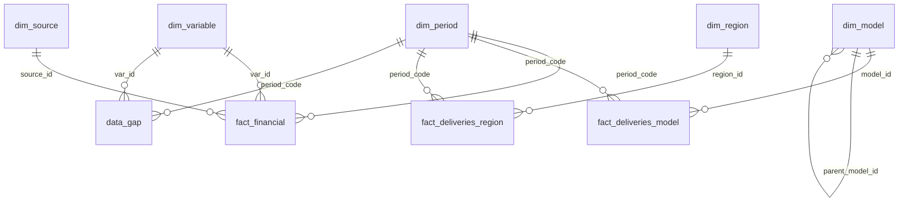

# Porsche Company Lens — SQL database (Phase 3)

> **Running from this repository**
> 1. Create a PostgreSQL 16 database named `porsche_lens`.
> 2. In this `sql/` folder, create `data/` and `output/`. Copy `../data/staging/*.csv` into `data/`.
> 3. Download Porsche's fact-sheet workbooks S024 and S025 (URLs in the source register). Run `python3 pcl_extract_factsheets.py <folder>` and put the resulting `fact_sheet_long.csv` in `data/`. This file is not committed because it copies Porsche's workbooks cell by cell.
> 4. From this folder, run `psql -d porsche_lens -f 00_run_all.sql`. Then run `12_export_mart.sql` (writes `output/`) and `13_powerbi_export.sql` (writes the Power BI tables to `data/`).
>
> Expected result: 27 sources, 13 audit findings, 423 PASS / 0 FAIL / 28 INFO in `audit.dq_result`. The exports should match [`../data/sql_outputs/`](../data/sql_outputs/) and [`../data/powerbi/`](../data/powerbi/); only the run timestamp in `dq_results.csv` changes.
>
> The phase notes below were written when the staging layer was built (S001–S026, AF-01–AF-11). The mart setup (`08_mart_setup.sql`) later adds source S027 and findings AF-12 and AF-13.

Database: **PostgreSQL 16** · name: `porsche_lens` · build script: `00_run_all.sql`

## 1. The idea in plain words

Porsche publishes numbers in two very different forms:
- an **Excel fact sheet** (quarterly P&L, cash flow, deliveries) → read by script,
- **PDF reports** (segment results, R&D, D&A, one-offs, bridge, ASP) → entered by hand in Phase 2.

The database brings both into **one table of numbers**, where every number has a period,
a variable, a source, a page and a FACT/DERIVED label. Around that table sit small
"lookup" tables that describe the periods, variables, models, regions and sources.

Three layers (schemas):

| Layer | What lives there | Rule |
|---|---|---|
| `stg` | the CSV files, loaded exactly as they are | no logic, easy to reload |
| `core` | the clean model: dimensions + facts, with keys | one number per period × variable |
| `audit` | sources, audit findings, data gaps, data-quality results | proves where every number came from |

## 2. Diagram



## 3. Tables

### core.dim_period — 40 rows (2022–2026)
| Column | Type | Meaning |
|---|---|---|
| period_code **PK** | varchar(8) | `2025-Q3`, `2025-H1`, `2025-H2`, `2025-9M`, `2025-FY` |
| period_type | varchar(3) | QTR / H1 / H2 / 9M / FY |
| fiscal_year, half_no, quarter_no | smallint | calendar breakdown |
| start_date, end_date, months | date / smallint | period length |
| sort_key | int, unique | chronological sort for charts |
| period_label | varchar(12) | `H1 2026` |
| is_half_year | boolean | TRUE for H1 and H2 — **the analysis grain** |
| in_analysis_window | boolean | TRUE for 2023-H1 … 2026-H1 (7 half-years) |

### core.dim_variable — 47 rows
| Column | Type | Meaning |
|---|---|---|
| var_id **PK** | varchar(10) | G01…, A01…, X01…, B01…, O01… (same IDs as Phase 1/2) |
| var_name, var_group, segment | text | description; group = Group P&L, EBIT bridge, Exceptional items, … |
| measure_type | varchar | flow / stock / ratio / per_share |
| aggregation | varchar | **SUM** (may be added over time) / **LAST** (period-end stock) / **NONE** (ratio — never add) |
| unit_std | varchar | EUR m, %, EUR k, units, EUR/share |
| is_memo | boolean | TRUE = "of which" item already inside another number (B05, X02, X05) |
| definition, comparability_note | text | Porsche definition and known caveats |

### core.dim_model — 8 rows
911, 718, Taycan, Panamera, Macan (subtotal), Macan ICE, Macan BEV, Cayenne.
`parent_model_id` links Macan ICE/BEV to Macan; `is_subtotal` prevents double counting.

### core.dim_region — 5 rows
North America, Europe excl. Germany, Germany, China incl. HK, Overseas & Emerging Markets.

### audit.dim_source — 26 rows
S001–S026 from the Source Register (document, URL, tier, notes).

### core.fact_financial — ~700 rows (the main table)
| Column | Type | Meaning |
|---|---|---|
| period_code **PK, FK** | varchar(8) | → dim_period |
| var_id **PK, FK** | varchar(10) | → dim_variable |
| value | numeric(20,6) | the number, in unit_std (money always EUR m) |
| unit_std | varchar | must equal dim_variable.unit_std (DQ10) |
| value_label | FACT / DERIVED | FACT = published; DERIVED = calculated from published numbers |
| origin | FACTSHEET / MANUAL / SQL_DERIVED | how it entered the database |
| source_id **FK** | varchar(10) | → dim_source (NULL only for SQL_DERIVED) |
| source_ref | varchar | page, sheet+cell, or the derivation formula |
| rounding, note | text | precision of the source; audit notes |

### core.fact_deliveries_model / core.fact_deliveries_region
`(period_code, model_id)` / `(period_code, region_id)` → deliveries (units), label, origin, source.

### audit tables
`audit.audit_finding` (AF-01…AF-11), `audit.data_gap` (values looked for but not verifiable),
`audit.dq_result` (every data-quality check, PASS/FAIL/INFO).

## 4. Design decisions (for the auditor)

| Decision | Why | What it cannot do / risk |
|---|---|---|
| **Long (narrow) fact table**: one row per period × variable | New variables need no schema change; every number carries its own source and label | Needs pivoting for wide views (Phase 4 views do this) |
| **All period types stored together** (QTR, H1, H2, 9M, FY) | Keeps Porsche's published numbers intact and lets us check quarters vs totals | Summing across period types would double count → always filter on `period_type` / `is_half_year` |
| **Half-year is the analysis grain** | R&D, D&A, one-offs, bridge and ASP are only published per H1 / FY | Only 7 half-year points → descriptive analysis, no statistics |
| **H2 = FY − H1, only for SUM variables** (06) | Porsche does not publish H2 | Inherits rounding of inputs (e.g. one-offs rounded to EUR 0.1bn); ratios are recalculated later, never subtracted (DQ11) |
| **A11 H1 2023 = A12 − A09** | Identity holds in every published period (DQ08) | Labelled DERIVED |
| **Fact sheet S025 only** | Latest file; S024 proved identical on 728 overlapping values | — |
| **Money stored in EUR m** | One unit for all money; bn inputs converted, original kept in stg | — |
| **Gaps are rows in audit.data_gap, never zeros** | No invented data | Phase 4 must decide explicitly how to treat "not published" (e.g. no one-offs disclosed in 2023–2024) and label it ASSUMPTION |

## 5. How to build it

1. Install **PostgreSQL 16** (includes pgAdmin and "SQL Shell (psql)").
2. Create the database: in pgAdmin → Databases → Create → `porsche_lens`
   (or `createdb -U postgres porsche_lens`).
3. Put this folder at `Porsche_Company_Lens/03_SQL/` with the `data/` subfolder inside.
4. Open **SQL Shell (psql)**, log in to `porsche_lens`, then:
   ```
   \cd 'C:/path/to/Porsche_Company_Lens/03_SQL'
   \i 00_run_all.sql
   ```
   (Mac/Linux terminal: `cd .../03_SQL` then `psql -U postgres -d porsche_lens -f 00_run_all.sql`)
5. The script prints row counts after each step and ends with `fail_rows = 0`.

To rebuild after changing the workbooks: run `python export_to_csv.py` (regenerates `data/`), then `\i 00_run_all.sql` again. Every script is re-runnable.

## 6. What you should see

| Step | Expected |
|---|---|
| staging | 1902 / 151 / 26 / 47 / 11 / 4 rows |
| core | fact_financial: 448 FACTSHEET + 151 MANUAL + 102 SQL_DERIVED = 701 rows; deliveries: 234 model + 175 region rows (incl. derived H2) |
| checks | DQ01–DQ11: all PASS, 0 FAIL · DQ12: 18 INFO (known gaps) · DQ13: 10 INFO (consolidation, EUR 113–297m) |

Quick checks you can run yourself:
```sql
SELECT * FROM audit.dq_result WHERE status = 'FAIL';                 -- must return nothing
SELECT period_code, value FROM core.fact_financial
WHERE var_id = 'G07' AND period_code LIKE '%-H_' ORDER BY period_code; -- group EBIT by half-year
SELECT * FROM audit.data_gap;                                          -- the 4 documented blanks
```

---

# Phase 4 — Analytical layer (`mart` schema)

Built by `08_mart_setup.sql`, `09_mart_views.sql`, `10_mart_quality_checks.sql` (all called by `00_run_all.sql`).
Answers: `11_key_questions.sql`. CSV export for Excel / Power BI: `12_export_mart.sql` → `output/`.

## Objects

| Object | Type | Purpose |
|---|---|---|
| `core.fact_guidance` | table | FY2026 guidance ranges (revenue, RoS, auto EBITDA margin, NCF margin, BEV share, extraordinary expenses) with sources |
| `mart.assumption` | table | A-01 … A-09: every modelling assumption, rationale and sensitivity |
| `mart.annotation` | table | Verified qualitative notes per period (tooltips) |
| `mart.view_catalog` | table | For every view: grain, measures, formula, assumptions, limitations, source lineage |
| `mart.v_panel_hy` | view | Half-year panel 2023-H1 … 2026-H1, all variables side by side |
| `mart.v_ebit_adjusted` | view | Headline: EBIT and margin at L0 reported / L1 excl. realignment & battery / L2 also excl. tariffs. Supplementary only: L3 hybrid sensitivity |
| `mart.v_da_clean` | view | Automotive D&A with disclosed impairments removed (no double count with one-offs) |
| `mart.v_rd_capitalisation` | view | Total R&D costs (Porsche definition, not a cash-flow figure) vs P&L charge, capitalisation rate, net capitalisation, effect of rate change |
| `mart.v_asp_volume` | view | Porsche ASP (automotive revenue / vehicles sold), volume vs ASP effect |
| `mart.v_delivery_mix` | view | Delivery shares by model line and region |
| `mart.v_cash_crosscheck` | view | Net cash flow vs EBIT/EBITDA, NCF margin, cash proxy and remainder |
| `mart.v_ebit_bridge_yoy` | view | Own decomposition of YoY EBIT change (EUR m and margin points); the last term is *residual / other EBIT drivers* (several unseparated effects) |
| `mart.v_guidance_2026` | view | 27 **scenario combinations** of guidance range ends (not forecasts, no probabilities): implied H2 2026 revenue, EBIT, margin L0/L1/L2 |
| `mart.v_guidance_2026_summary` | view | Min / mid / max across the scenario combinations (mid = all midpoints, not a most-likely case) vs H1 2026 and H2 2025 |
| `mart.v_guidance_2026_auto` | view | 9 scenario combinations: implied H2 2026 automotive EBITDA and NCF margin |

## Adjusted EBIT levels

| Level | Formula | Meaning |
|---|---|---|
| L0 | G07 | Reported group EBIT |
| L1 | G07 + X01 | Excl. Porsche's disclosed strategic-realignment and battery items, **net** of related provision releases |
| L2 | L1 + X03 | Also excl. US import tariffs |
| L3 *(supplementary hybrid sensitivity)* | L1 + (A12 − X05) − A06 | EBITDA-type figure with total automotive R&D costs expensed as incurred. Mixes group EBIT with automotive-only items → **not** underlying group profitability, **not** a headline KPI |

Impairments (X05) are **not** added in L1/L2: they are already inside X01 → no double count (check MQ05).
**Headline KPIs are L1 and L2.** L3 is kept only as a sensitivity.

## Bridge residual
`eff_residual_other_drivers` (and `pp_residual_other_drivers`) = change in EBIT minus the separated effects. It is **not operating
performance**: it mixes price, model/derivative mix and volume, changes in total R&D costs, material and supplier costs (incl. BEV
compensation payments), SG&A, other operating result, FX, consolidation, and the rounding of disclosed one-offs (±EUR 100–200m).

## Quality checks on the views (MQ01–MQ28, 118 results, 0 FAIL)

Pivot completeness; L0 = core EBIT and = published RoS; adjustment ladder; L3 identity; assumption IDs exist;
clean D&A arithmetic; capitalisation rate and ASP reconcile to Porsche; volume + ASP effect = revenue change;
delivery shares = 100%; NCF = CFO + investing and = published NCF margin; EBITDA margin = published;
EUR and margin-point bridges close; own bridge = Porsche bridge buckets; guidance grid arithmetic; every view documented.
Two tolerances reflect Porsche's own rounding (AF-12: H1 2024 NCF stored rounded; D&A components rounded to EUR 1m).

Also checked: labelling guard MQ28 (no `cash_spend` / `operating_residual` column names; every L3 row and every guidance row carries its label).

## Change log — Phase 4 cleanup (2026-09-28)
| # | Change | Objects |
|---|---|---|
| 1 | `rd_cash_spend` → `rd_total_costs`, `rd_spend_pct_auto_revenue` → `rd_total_costs_pct_auto_revenue`, `yoy_rd_cash_spend` → `yoy_rd_total_costs`; "cash spend" wording removed | v_rd_capitalisation, catalogue, MQ12, Q4 |
| 2 | `ebit_l3_cash_rd_pre_da` → `ebit_l3_hybrid_sensitivity`, `margin_l3_pct` → `margin_l3_hybrid_pct`, `ebit_l3_alt_a04` → `ebit_l3_hybrid_alt_a04`; new column `l3_label` | v_ebit_adjusted, catalogue, MQ07, Q5 |
| 3 | `eff_operating_residual` → `eff_residual_other_drivers` (+ `_alt_a04`), `pp_operating_residual` → `pp_residual_other_drivers`; contents documented | v_ebit_bridge_yoy, catalogue, MQ19–MQ21, Q3 |
| 4 | Double_checked rule applied to every row (Y/N/N/A) + `verification_basis` carried into SQL | PCL_02, stg.manual_inputs, 05_transform_core |
| 5 | Columns `scenario_id`, `scenario_type` ("scenario combination – not a forecast, no probability") | v_guidance_2026, _summary, _auto, catalogue, Q8 |
| 6 | New check MQ28 (labelling guard) | 10_mart_quality_checks |
No source value, formula or methodology was changed; all numeric results are identical to the pre-cleanup build.
